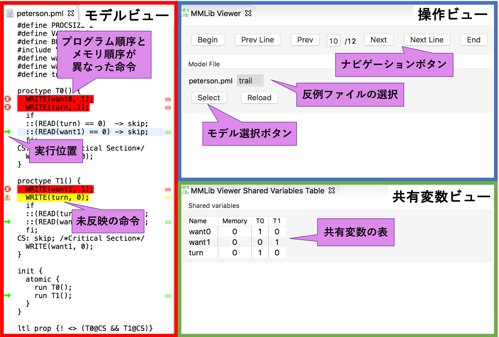

# MMLib Counterexample Visualizer
本リポジトリでは，[「MMLib」](https://github.com/plasklab/mmlib)
の反例を可視化するソフトウェアを公開しています．
本ソフトウェアを使用することで，モデル上に「MMLib」の反例に沿ったステップ実行の様子を表示できます．
本ソフトウェアはEclipseのプラグインとして実装されています．
最新のソフトウェアは，「jp.ac.kochi-tech.info.pl.mmlib.viewer_1.0.0.201812140943.jar」です．

## 動作環境
- SPIN (6.4.6で動作を確認)
- Eclipse (Eclipse2018-09で動作を確認)

### 必須プラグイン
- org.eclipse.core.resources (3.13.100)
- org.eclipse.jface.text (3.14.0)
- org.eclipse.swtbot.go (2.7.0)
- org.eclipse.ui.editors (3.11.200)
- org.eclipse.ui.ide (3.14.100)


## 環境構築の例
MacOSでEclipse2018-09のEclipse IDE for Java Developersに本ソフトウェアを導入する手順は以下の通りです．
1. 公式サイトから[Eclipse IDE for Java Developers](https://www.eclipse.org/downloads/packages/release/2018-09/r/eclipse-ide-java-developers)をダウンロード・インストールする．
2. 必要なソフトウェアをインストールする．メニューバーから「Help」 -> 「Install New Software」の順に選択し，開かれたダイアログの「Work with」テキストボックスのプルダウンメニューから 「2018-09 - http://download.eclipse.org/releases/2018-09」を選択する．
ダイアログの中央の表にダウンロード可能なソフトウェアの一覧が表示されるので，
  - SWTBot for Eclipse Testing
  - Eclipse Plug-in Development Environment  
  をインストールする．
3. Eclipseの「dropins」に本ソフトウェアを配置する．
MacにEclipse_2018-09をインストールした場合は，以下のディレクトリに配置する．
```
インストールしたディレクトリ/Applications/Eclipse_2018-09.app/Contents/Eclipse/dropins/
```
4. Eclipseを再起動する．


## 使用方法
### 必要なファイル
  - モデルのファイル
  - 「MMLib」のライブラリのファイル  
  ※本ソフトウェアを使用する場合は，本リポジトリの`library`ディレクトリ内のライブラリを使用する
  - trailファイル（反例ファイル）
  - 共有変数情報ファイル  
  モデルで使用する共有変数の情報を記述する．  
  ファイル名は「モデルのファイル名」，拡張子は「.in」．  
  例：モデルのファイルが：「model.pml」なら「model.in」  
  [専用の文法](#共有変数情報ファイルの文法)で記述する．

### 画面構成
  

### 使用手順
  1. MMLibを使用したモデルをモデル検査する．  
  ※本リポジトリの`library`ディレクトリ内のライブラリを使用する．
  1. Eclipseのワークスペースに各ファイルを同じディレクトリにインポートする．
  2. メニューバーから「Window」 -> 「Show View」 -> 「Other…」の順に選択し，表示されるダイアログ中の「General」フォルダの下の「MMLib Viewer」を選択する．共有変数の一覧を表示したい場合は「MMLib Viewer Shared Variables Table」を，ローカル変数の一覧を表示したい場合は「MMLib Viewer Local Variables Table」をそれぞれ選択する．
  3. 操作ビューのモデル選択ボタンをクリックし，プログラムのモデルを選択する．プログラムのモデルを選択せると，反例ファイルの一覧が自動的に表示される．
  4. 反例ファイルの一覧から，使用するファイルを選択する．
  ファイルを選択すると，反例は自動的に解析される．
  再読み込みしたい場合は「Reload」ボタンをクリックする．
  5. [各種ボタン](#操作方法)からステップ実行を操作する．


### 操作方法
  - ナビゲーションボタン  
    - Begin  
    最初のステップに戻る
    - Prev Line  
    モデルの行で1行戻る
    - Prev  
    1ステップ戻る
    - Next  
    1ステップ進む
    - Next Line  
    モデルの行で1行進む
    - End  
    最後のステップに進む

### 共有変数情報ファイルの文法
```
<行>       ::= <element> at <location>
<element>  ::= <scalar> | <array> | <struct>
<scalar>   ::= <変数名>
<array>    ::= <element> [ <整数値> ]
<struct>   ::= <変数名> { <element>* }
<location> ::= <変数番号> | next <変数名>
```
