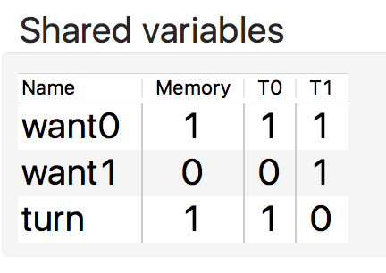

## MMLib Counterexample Visualizerのチュートリアル
[READMEへ戻る](../README.md)

使用するモデル：[ピーターソンの相互排除アルゴリズムのプログラムのモデル](./peterson/)

### ピーターソンの相互排除アルゴリズムのプログラムのモデル

#### 1.ファイルの作成
プログラムのモデルから，反例ファイルと共有変数情報ファイルを作成します．
反例ファイルはMMLibを使用したプログラムのモデルを，SPINでモデル検査して作成してください．
共有変数情報ファイルは，[文法](../README.md/#共有変数情報ファイルの文法)に従って作成してください．

以降のチュートリアルで使用するファイルは，`/tutorial/peterson`ディレクトリの中に用意しています．

#### 2.ファイルの配置
`/tutorial/peterson`ディレクトリの中の各ファイルをEclipseにインポートしてください．
ファイルは，次のように同じディレクトリに配置してください．


#### 3.ファイルの選択
本ソフトウェアの操作ビューのモデル選択ボタンをクリックし，表示されるダイアログからモデル（`peterson.pml`）を選択してください．
次のように反例の一覧が表示されるので，使用したい反例を選択してください．


#### 4.ステップ実行
反例を選択すると，反例が解析されて，ステップ実行できるようになります．
ステップ実行の操作は，[操作方法](../README.md/#操作方法)を参照してください．

#### 5.デバッグ

##### 5.1.peterson.pmlの概要
peterson.pmlは，スレッドT0とT1の相互排除を行うプログラムのモデルです．
各スレッドは/\* Critical Section \*/で表されるクリティカルセクションに入ろうとします．

共有変数want0とwant1はそれぞれT0とT1がクリティカルセクションに入ろうとしていることを他のスレッドに表明するためのフラグです．各スレッドはこのフラグに1を書き込んでからクリティカルセクションに入るための待ち状態に入ります．
待ち状態は，Promelaのif文で表されています．if文のいずれかの条件式が真になると，待ち状態を抜けてクリティカルセクションに入ります．共有変数turnは，デッドロックを防ぐための変数です．turnが0の時はT0が，1の時はT1が優先的にクリティカルセクションに入れます．

ピーターソンの相互排除アルゴリズムは，弱いメモリモデルの上では相互排除できないことが知られています．
その原因は，各スレッドの書き込みが他のスレッドからは観測できないまま，待ち状態を抜けてしまうことです．
以下では，このモデルのバグの原因を本反例可視化ソフトウェアを使って特定します．

##### 5.2. バグの原因の特定と対処
ステップ実行を進めていくと，ステップ6で次のようにハイライトされます．このステップでは，`READ(want0) == 0`が実行されました．
WRITEが赤色でハイライトされていますが，どれもwant0に対する書き込みではないので，バグの原因ではありません．


さらにステップ実行を進めると，ステップ10で次のようにハイライトされました．このステップでは，T0の`READ(want1) == 0`が実行されました．
ハイライトされているWRITEのうち，T0が実行したWRITEはwant1を対象にしていないので，バグの原因ではなさそうです．


一方，T1のWRITEのうち，want1に対するWRITEが赤色でハイライトされています．T0からはこのWRITEの結果が観測できないので，次の共有変数の表からわかるようにwant1から0を読み出しています．T0はこの後クリティカルセクションに入れてしまうので，相互排除に失敗します．


以上のことから，T1の`WRITE(want1, 1)`の結果がT0で`READ(want1)`を実行する際に観測できなかったために，
両方のスレッドがクリティカルセクションに入ってしまったとわかります．


相互排除に失敗する原因がわかったので，フェンス命令を挿入して，
他のスレッドからWRITEの結果を観測できるようにします．
挿入位置は，T0の`if`の前です．
また，このT0とT1は対称になっているので，
T1の`if`の前にもフェンス命令を挿入します．
フェンス命令を挿入すると，次のようなモデルになります．


このモデルにはまだバグがあり，もう一度SPINでモデル検査するとエラーを検出します．
なお，モデル検査は次のコマンドで行います．
```
$ spin -a peterson.pml
$ gcc -DNOREDUCE pan.c
$ ./a.out -a -I
```
反例が出力されるので，Reloadボタンを押して，反例を読み込み直します．


再びステップ実行を進めていくと，
ステップ9でWRITEが赤色でハイライトされました．
また，このステップでは，
直前のステップで黄色でハイライトされていた`WRITE(turn, 0)`のハイライトが消えています．
つまり，この赤色のハイライトはT1の`WRITE(turn, 0)`が`WRITE(want1, 1)`よりも先に共有変数に反映されたことを表しています．


続くステップ10では，T0のフェンス命令が実行され，
`WRITE(turn, 1)`が共有変数に反映されました．
しかし，T1の`WRITE(want1, 1)`はまだ共有に反映されていません．
そのため，T0はwant1から0を読み出してクリティカルセクションに入れるようになっています．
実際に11ステップ目で，want1から0を読み出してクリティカルセクションに入ります．




その後のステップ12では，T1がフェンス命令を実行したことで，
`WRITE(want1, 1)`が共有変数に反映されました．
この後T1は，待ち状態に入りますが，
turnが1なので，すぐに待ち状態を抜けることができます．
その場合には，既にT0がクリティカルセクションに入っているので，
両方のスレッドがクリティカルセクションに入ることになります．


相互排除に失敗した原因は，ステップ9で，
T1の`WRITE(turn, 0)`が`WRITE(want1, 1)`よりも先に共有変数に反映されたことです．
つまり，これらの間にもフェンス命令を挿入する必要があります．
加えて，T0とT1は対称なので，T0の`WRITE(turn, 1)`と`WRITE(want0, 1)`の間にもフェンス命令を挿入する必要があります．
フェンス命令を挿入すると，次のようなモデルになります．


このモデルを再度SPINでモデル検査すると，
SPINはエラーを検出しませんでした．
ここまでで，弱いメモリモデルの上でも相互排除ができるように，
ピーターソンの相互排除アルゴリズムをデバッグできました．
